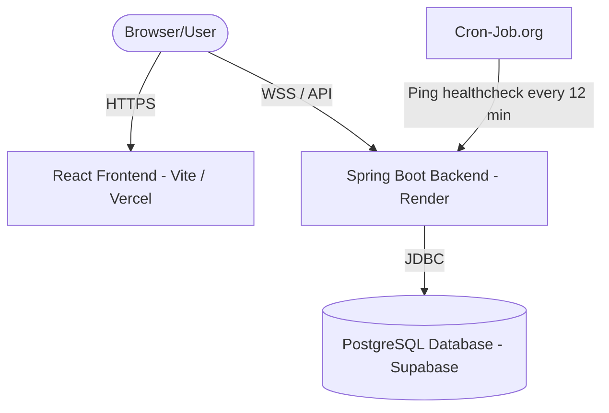

# Clarifyr 🎓 

[](https://spring.io/projects/spring-boot)
[](https://reactjs.org/)
[](https://vite.dev/)
[](https://www.docker.com/)
[](https://opensource.org/licenses/MIT)

**Clarifyr** is a premium, real-time, peer-to-peer doubt-solving marketplace that connects students with expert tutors. Designed to solve debug queries, academic concepts, or design dilemmas instantly, Clarifyr features real-time communication via WebSockets, interactive tutor scheduling, booking management, and a robust rating/review system.

---

## 🏗️ Architecture Overview

Clarifyr is split into a **Spring Boot** backend API and a **React + Vite** SPA frontend, utilizing **MySQL** for local containerized development and **PostgreSQL** in production.



---

## ⚡ Tech Stack

| Component | Technology | Description |
| :--- | :--- | :--- |
| **Backend Framework** | Spring Boot 3.5.x | High-performance Java Web API & WebSocket server |
| **Language** | Java 21 | Modern LTS Java runtime features |
| **Security** | Spring Security + JWT | State-free authentication and role-based endpoint protection |
| **WebSockets** | Spring WebSocket + STOMP | Broker-backed bidirectional message transport for chat |
| **Persistence** | Spring Data JPA (Hibernate) | Database mapping layer with transaction management |
| **Frontend SPA** | React 18.x | Dynamic, hook-driven component rendering |
| **Build Tool (FE)** | Vite | Fast Hot Module Replacement (HMR) and optimized build outputs |
| **Styling** | Vanilla CSS | Custom, premium design system featuring a responsive glassmorphic dark UI |
| **Containerization** | Docker & Docker Compose | Pre-configured environment setups for quick onboarding |
| **Databases** | MySQL (Local) / PostgreSQL (Prod) | Structured relational schemas |

---

## 🚀 Key Features

* **🔍 Tutor Discovery & Search**: Filter tutor profiles by tags/subjects (e.g., *Java, Web Development, Math, Figma*) and hourly rate.
* **💬 WebSocket Chat System**: A custom real-time messaging interface that lets users chat without polling. Message history is archived and loaded dynamically.
* **📅 Booking & Schedule Manager**: Request tutoring sessions, set start times, configure duration, and track bookings through an interactive dashboard with live status updates (*Pending, Accepted, Declined*).
* **⭐ Feedback & Reviews**: Give tutors a star rating (1–5) and write written reviews to help build community trust.
* **🔒 JWT Authentication**: Secure user login and registration supporting distinct student/tutor user types and roles.
* **🌱 Auto-Seeding Database**: Automatically populates 1 student and 3 highly realistic tutor profiles (with avatars, descriptions, and hourly rates) on first boot.

---

## 📂 Project Structure

```text
Clarifyr/
├── src/                                  # Spring Boot Java Backend
│   ├── main/
│   │   ├── java/com/clarifyr/
│   │   │   ├── config/                   # CORS, Security, WebSockets, & Data Seeders
│   │   │   ├── controller/               # REST Endpoints (Bookings, Chat, Discovery, Users)
│   │   │   ├── dto/                      # Data Transfer Objects
│   │   │   ├── entity/                   # Database Entities (User, TutorProfile, Booking, ChatMessage, Review)
│   │   │   ├── repository/               # Spring Data JPA Repository Interfaces
│   │   │   ├── security/                 # JWT Filters, Tokens, & Security Context Configuration
│   │   │   └── service/                  # Business Logic Layer
│   │   └── resources/
│   │       ├── application.properties    # Main Config
│   │       └── application-local.properties.example # Sample local config
│   └── test/                             # Backend Unit & Integration Tests
│
├── clarifyr_frontend/                    # React SPA Frontend
│   ├── src/
│   │   ├── components/                   # Shared UI Components (Navbar, StarRating)
│   │   ├── screens/                      # Views (Chat, Login, Profile, Schedule, Discovery)
│   │   ├── App.jsx                       # Routing & Protected Route wrappers
│   │   ├── api.js                        # HTTP Central API fetch wrapper
│   │   ├── index.css                     # Premium global CSS styles & variables
│   │   └── main.jsx                      # React Entry point
│   ├── Dockerfile                        # Production Frontend build instructions
│   └── nginx.conf                        # Frontend web server routing setup
│
├── docker-compose.yml                    # Local multi-container deployment
├── Dockerfile                            # Production Backend build instructions
└── DEPLOYMENT.md                         # Detailed production cloud deployment guide
```

---

## 🛠️ Quick Start (Local Development)

### Option A: Using Docker Compose (Recommended)

Make sure you have [Docker Desktop](https://www.docker.com/products/docker-desktop/) installed.

1. **Clone the repository** and navigate to the project directory:
   ```bash
   cd Clarifyr
   ```
2. **Launch all services**:
   ```bash
   docker compose up --build
   ```
3. **Access the application**:
   * **Frontend Application**: [http://localhost](http://localhost) (runs on port `80`)
   * **Backend REST API**: [http://localhost:8080/api](http://localhost:8080/api)
   * **MySQL Database**: `localhost:3306` (Credentials: `root` / `rootpassword`)

To stop and remove containers & volumes:
```bash
docker compose down -v
```

---

### Option B: Manual Startup (Without Docker)

#### Prerequisites
* **Java SDK 21** or higher
* **Node.js** (v18+) & **npm**
* **MySQL Server** running locally

#### 1. Backend Setup
1. Create a database in MySQL named `clarifyr_db`:
   ```sql
   CREATE DATABASE clarifyr_db;
   ```
2. In `src/main/resources/`, copy/create `application-local.properties` and add your database password:
   ```properties
   spring.datasource.password=your_mysql_password
   ```
3. Run the Spring Boot application using Maven:
   ```bash
   ./mvnw spring-boot:run
   ```
   *The backend will boot up at `http://localhost:8080`.*

#### 2. Frontend Setup
1. Navigate to the frontend directory:
   ```bash
   cd clarifyr_frontend
   ```
2. Install dependencies:
   ```bash
   npm install
   ```
3. Start the Vite development server:
   ```bash
   npm run dev
   ```
   *The frontend will open at `http://localhost:5173`.*

---

## 👥 Demo Credentials

The database seeder automatically creates the following accounts on initial startup:

| Role | Email | Password | Preseeded Profile Details |
| :--- | :--- | :--- | :--- |
| **Student** | `student@clarifyr.com` | `password123` | Active student account. |
| **Tutor 1** | `tutor@clarifyr.com` | `password123` | **Jane Doe**: Java, Spring Boot, Web Development ($45/hr) |
| **Tutor 2** | `alex.tutor@clarifyr.com` | `password123` | **Alex Rivera**: Mathematics, Physics, Calculus ($35/hr) |
| **Tutor 3** | `sarah.tutor@clarifyr.com` | `password123` | **Sarah Jenkins**: UI/UX Design, Figma, HTML & CSS ($40/hr) |

*Log in with any of these to immediately test the search, bookings, and real-time chat!*

---

## 🌐 Production Deployment

For deploying the stack to production cloud providers:
* **Backend**: Docker deployment on Render, Railway, or Koyeb.
* **Database**: PostgreSQL hosted on Supabase (Generous free tier).
* **Frontend**: Static site build hosted on Vercel (Fast global CDN).
* **Availability**: Cron-Job.org backend pinging workaround to prevent cold starts on Render's free tier.

---

## 📜 License

Distributed under the MIT License. See `LICENSE` for more information (if applicable).
